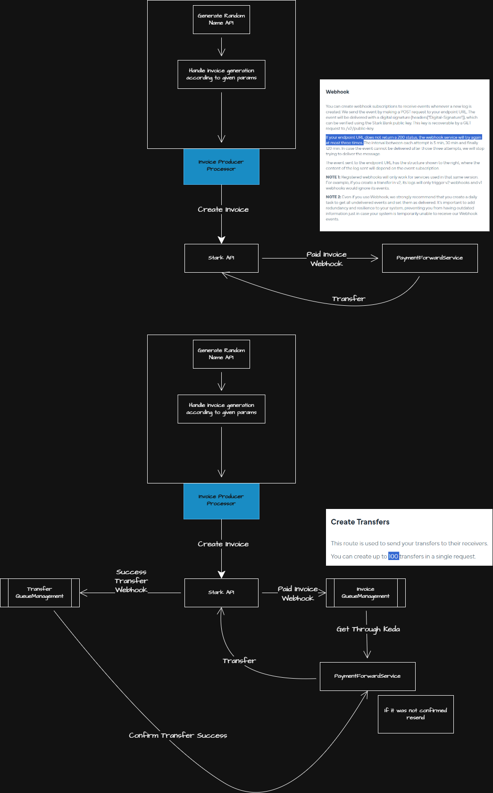

# How to run?

The project is divided into two services
**I know that providing sensitive data on yaml is not good** but I did it to be quicker...

## Invoice Producer

See variables on *Invoice-Producer\docker-compose.yml*, you can configure them or use as it is

- STARKBANK_PRIVATE_KEY :  Project Pem Key, configured through Stark Sandbox Portal
- STARKBANK_PROJECT_ID : Project Id located on Stark Sandbox Portal
- STARKBANK_ENVIRONMENT : Which project it is, in case we integrate with prod env.
- STARKBANK_INVOICE_INTERVAL : Time interval that the invoices will be sent, 180 is the 3h exercice required, but in order to ease the test, you can set it as 1, and see invoices being sent.
- STARKBANK_RUNTIME_INTERVAL : It should run 24h, but if a greater time range is needed, set it as the minutes of a day.

### Run
Go to directory and simply run **docker-compose up** if your machine does have Docker, it was configured so that can be run in any setup enviroment!

## Payment Forward

## Why different Services?

It doesn't make sense put them together, they have different responsabilities...
Also, it's easier to identify bugs with separated services as one can blow up while the other is correctly sending the invoices.

## To quickly answer as bullet points on PDF, follows the text:
### Although, I will provide detailed information later

- How much have you learned during the trial?
  - Read section 'What I learned'
- How well does your code run?
  - I provide a Dockerfile in order to ease running both for me and for those who shall execute it. Also, right now I'm trying to integrate it with the cloud, which may ease the process for me.
- Did you create unit tests or did you leave bugs hidden in your code?
  - I created some unit tests mocking external services
  - There's a TaxId condition, it will always send with this same CPF, I tried finding a CPF/CNPJ generator, but
- How readable and efficient is your code?
  - I try following SOLID and Clean Architecture principles, dividing objects and responsibilities, naming variables according to their functions, for a smoother understanding. For time management when processing invoices, it may get complicated to understand, not gonna lie, but logs ease this process.
- How quickly did you deliver the finished task?
  - It was a tough week for me, I should have delivered the feature itself after about 2 hours, but the Webhook management took me a while.

# What I learned

- I tried a new request app similar to Postman: **ApiDog**, it was cool! should try
- I never used **ngrok** and loved using it in order to test your webhook! It was easy to set it.
- Gradle Stark SDK: I was sort of resistent using SDK when integrating something, it was really easy to use your API.
- Spring API from scratch : I am used to Spring daily, but creating something new without all 'Ctrl Cs' from other services in code base, configuring gradle, it always make me learn something...
- I'm trying to learn how to set it on AWS... Hope I succeed by the time we contact!

## What I would try with more time:

Below is the designed architecture, and what ideally should have been done

- Current: I played a little with the Producer, integrating with a name generation open API, randomly setting how many invoices I should use in a certain interval, and creating them, only then starting to produce. In production, the other service running will receive the webhook, and if the invoice is credited, it will make the transfer.

- What I'd wish: Introduce 2 queues using RabbitMq, Kafka, ServiceBus. Once the webhook is received, it should include the message into one queue, the flow that would create a transfer according to received invoices would be started by KEDA, only scaling up as messages go into the queue, being able to scale up as many invoices are sent. Also, we would know if other things are being received by our webhook, they would go to dead letter, and manage if it's needed a block, a filtering, etc.
Once the transfer is processed, I only call it, and trust it will go to Stark, but I've seen that you have a success webhook for it too, using another queue in order to retry the messages sent and remove them as 'success' is received would make the transfer system robust.
